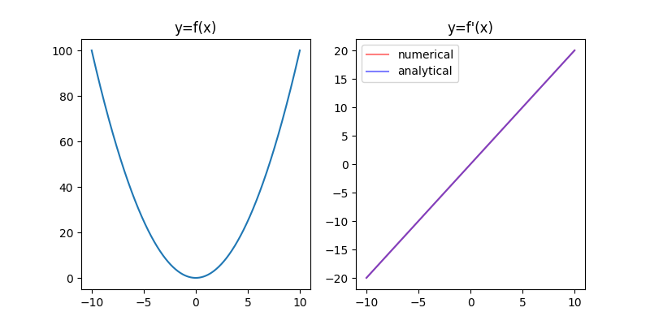
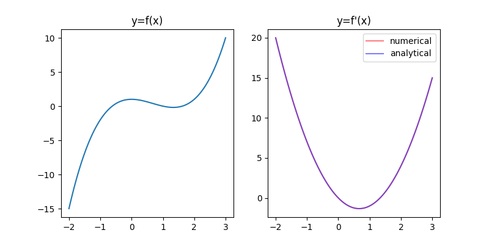
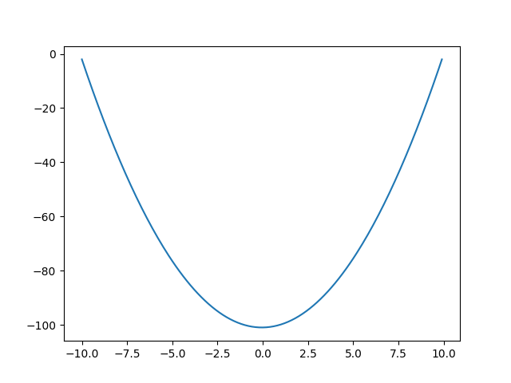

<h1>EEM 208/220 Mühendislik Matematiği</h1>
<h2>Nümerik Türev</h2>
<p align="justify">Türev operatörü bir fonksiyonun değişimini hesaplar. Bir fonksiyonun bir noktadaki türevi o noktadaki eğimidir. Örnek olarak, eğer $f(x)=x^2$ şeklinde bir fonksiyon için, $x$ noktasındaki değişimi veren fark denklemini yazacak olursak, küçük $\delta x$ değerleri için</p>

```math
f'(x) = \frac{f(x+\delta x)-f(x)}{\delta x}
```

<p align="justify">elde edilir. Bu şekilde örnekler üzerinde fark denklemiyle hesaplanan türev nümeriktir. Aşağıda kodda hem nümerik hem analitik türevi hesaplayıp çizdirelim.</p>

```
import numpy as np
import matplotlib.pyplot as plt
 
# Girişin karesinin alan fonksiyonu tanımlayalım
def f(x):
    return x**2
 
# x=-10'dan x=10'a kadar örnek üretelim
x = np.linspace(-10,10,500)
y = f(x)
# grafiğin sol tarafına f(x)'i çizdirelim
fig = plt.figure(figsize=(8,4))
ax = fig.add_subplot(121)
ax.plot(x, y)
ax.set_title("y=f(x)")
 
# nümerik ve analitik türevler: f'(x) hesaplayalım
delta_x = 0.0001
y1 = (f(x+delta_x) - f(x)) / delta_x # nümerik
y2 = 2 * x # analitik
# grafiğin sağ tarafına f'(x)'i çizdirelim
ax = fig.add_subplot(122)
ax.plot(x, y1, c="r", alpha=0.5, label="numerical")
ax.plot(x, y2, c="b", alpha=0.5, label="analytical")
ax.set_title("y=f'(x)")
ax.legend()
 
plt.show()
```

<figure>
    
    <figcaption>Nümerik ve analitik türevi alınan kare fonksiyonu</figcaption>
</figure>

<p>Başka bir örnek olarak, $f(x)=x^3-2x^2+1$ fonksiyonun nümerik türevini alalım. Kod kısmında ilgili yerleri değiştirecek olursak aşağıdaki grafiği elde ederiz.</p>

<figure>
    
    <figcaption>Nümerik ve analitik türevi alınan başka bir fonksiyon</figcaption>
</figure>
<h2>Nümerik İntegral</h2>
<p align="justify">Bu derste integralin türevin tersi olduğunu nümerik olarak göreceğiz. Yukarıda nümerik türev konusunda ele aldığımız ilk fonksiyon $f(x) = x^2$ idi. Madem integral türevin ters operatörü, o zaman burda ilk örneğimiz $f(x)=2x$ olsun ve bu fonksiyonun nümerik integralini alalım. Burada $x=-10$'dan $x=10$'a kadar $\delta x = 0.1$ örnekleme periyoduyla örnek üretelim.</p>

$$f(-10), f(-9.9), f(-9.8), \ldots, f(9.8), f(9.9), f(10)$$

<p align="justify">Burada örnekleme periyodu dediğimiz $\delta x$'e aynı zamanda adım büyüklüğü (İng. step size) da diyebiliriz. Doğal olarak $\delta x$ küçüldükçe yukarıdaki terim sayısı artacaktır. Yukarıdaki terimlerin (son terim hariç) her birisini adım büyüklüğü ile çarpıp ardından toplayalım.</p>

$$0.1f(-10)+0.1f(-9.9)+0.1f(-9.8)+ \ldots + 0.1f(9.8)+0.1f(9.9)$$

<p align="justify">Bu toplama nümerik integral denir. Burada $f(x)=2x$ fonksiyonunun $x=-10$'dan $x=10$'a kadar altındaki alanı bulmuş olduk. Analitik olarak ifade etmek gerekirse</p>

$$\int f(x)dx = \int 2xdx = x^2$$

<p align="justify">Kod ile nümerik integral alalım ve sonucu çizdirelim.</p>

```
import numpy as np
import matplotlib.pyplot as plt

def f(x):
    return 2*x

delta_x = 0.1
x = np.arange(-10,10,delta_x)
fx = f(x)*delta_x
y = fx.cumsum()

plt.plot(x,y)
plt.show()
```



<h3>Kaynaklar</h3>
[1] https://machinelearningmastery.com/calculus-for-machine-learning-7-day-mini-course/